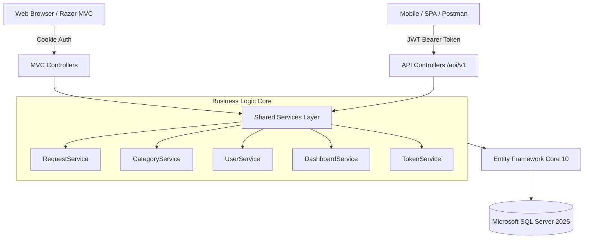
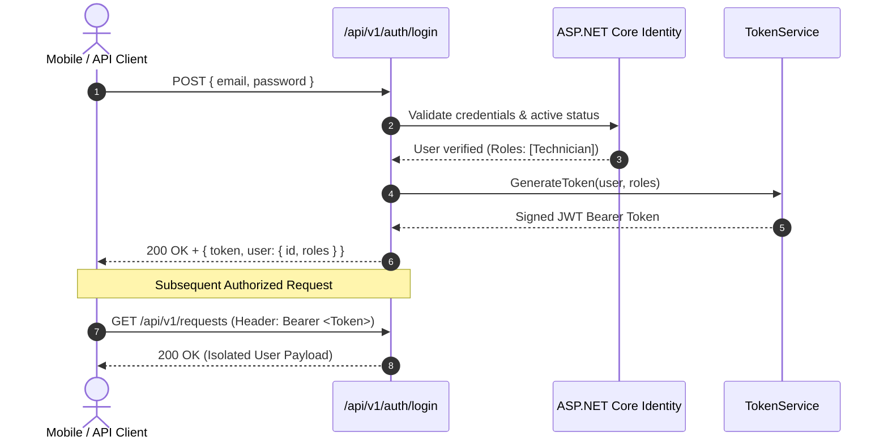
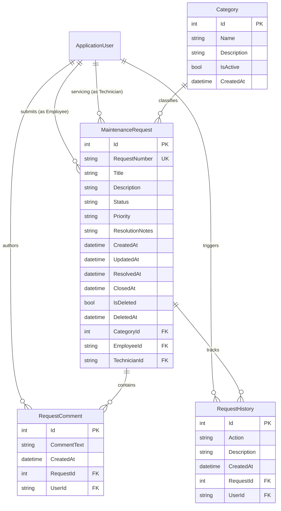
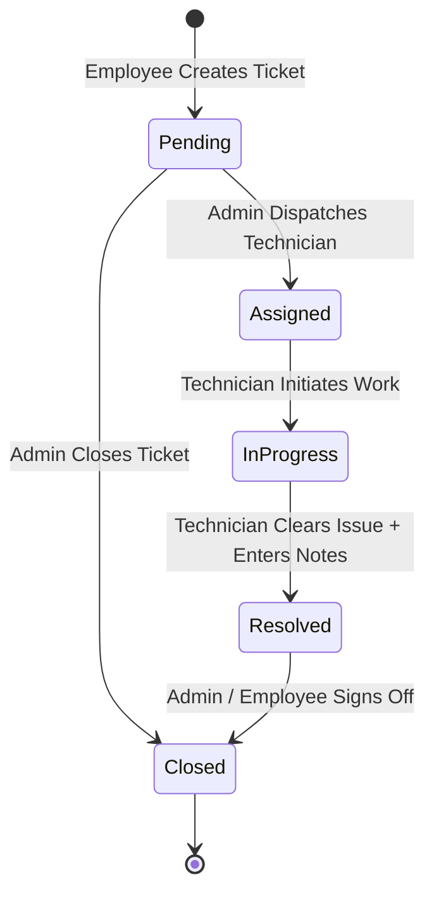

# 🛠️ Maintenance Request System (MRS)
## Comprehensive Technical Documentation & Architecture Manual
**ASP.NET Core 10 MVC + RESTful Web API Enterprise Architecture**

---

<!-- pagebreak -->

# [Page 1] Project Overview & Executive Summary

## 1.1 Introduction
The **Maintenance Request System (MRS)** is an enterprise-grade hybrid application architected on **.NET 10**, combining an intuitive **ASP.NET Core MVC (Razor Views)** user interface and a modern, secure **RESTful Web API (`/api/v1`)**. 

Designed to streamline issue tracking, infrastructure management, and resource allocation, MRS enables internal employees to submit maintenance tickets, administrators to dispatch and manage tasks, and technical teams to track and resolve operational problems across facilities.

```
┌─────────────────────────────────────────────────────────────────────────┐
│                      MAINTENANCE REQUEST SYSTEM                        │
├────────────────────────────────────┬────────────────────────────────────┤
│         ASP.NET Core MVC           │          RESTful Web API           │
│   Server-Side Rendered Razor UI    │       Mobile / SPA / External      │
│   Cookie-based Identity Session    │     JWT Bearer Token Security      │
├────────────────────────────────────┴────────────────────────────────────┤
│                  SHARED SERVICE & BUSINESS LOGIC LAYER                  │
│       IRequestService | ICategoryService | IUserService | IDashboard    │
├─────────────────────────────────────────────────────────────────────────┤
│                   DATA ACCESS & STORAGE (EF CORE 10)                    │
│           Entity Framework Core 10 Code-First + SQL Server 2025         │
└─────────────────────────────────────────────────────────────────────────┘
```

## 1.2 Core Objectives
- **Zero Business Logic Duplication:** Unified service layer powering both MVC Controllers and API Controllers.
- **Strict Role-Based & Resource-Level Security:** Fine-grained authorization differentiating Admins, Technicians, and Employees.
- **RESTful Compliance:** Standardized JSON contracts (`ApiResponse<T>`), explicit HTTP status codes, query filtering, and deterministic sorting.
- **Complete Auditability:** Automated chronological event history tracking for every lifecycle status transition.

## 1.3 Target Audience & Client Ecosystem
1. **Corporate Portal Users:** Employees submitting work orders through desktop web browsers.
2. **Field Technicians:** Specialized mobile apps or tablet browsers to update repair logs on-site.
3. **Operations Management:** Administrators monitoring SLAs and workload through real-time dashboards.
4. **Third-Party Systems:** External enterprise systems querying ticket states via authenticated REST APIs.

---

<!-- pagebreak -->

# [Page 2] Architectural Design & Clean Tier Organization

## 2.1 System Architecture Breakdown
The solution is organized following modern clean architecture principles to maximize modularity and code reuse.



## 2.2 Directory & Solution Structure
```
MaintenanceRequestSystem/
├── Controllers/
│   ├── HomeController.cs
│   ├── AccountController.cs          <-- MVC Authentication
│   ├── DashboardController.cs        <-- MVC Role Views
│   ├── RequestsController.cs         <-- MVC Ticket Flow
│   ├── CategoriesController.cs       <-- Admin Categories
│   ├── UsersController.cs            <-- Admin User Mgmt
│   └── API/
│       ├── AuthApiController.cs       <-- POST /api/v1/auth/*
│       ├── RequestsApiController.cs   <-- /api/v1/requests/*
│       ├── CategoriesApiController.cs <-- /api/v1/categories/*
│       ├── UsersApiController.cs      <-- /api/v1/users/*
│       └── DashboardApiController.cs  <-- /api/v1/dashboard/*
├── Models/
│   ├── ApplicationUser.cs            <-- IdentityUser Extension
│   ├── MaintenanceRequest.cs         <-- Core Domain Entity
│   ├── Category.cs                   <-- Equipment Category
│   ├── RequestComment.cs             <-- Discussion Thread
│   ├── RequestHistory.cs             <-- Audit Trail Records
│   └── Enums/                        <-- RequestStatus, Priority, RequestAction
├── DTOs/                             <-- Request/Response Data Contracts
├── Services/                         <-- Shared Business Rules Implementations
├── Data/                             <-- ApplicationDbContext & Migrations
├── Middleware/                       <-- GlobalExceptionMiddleware
└── Extensions/                       <-- ServiceCollection Configurations
```

---

<!-- pagebreak -->

# [Page 3] Security, Identity & Dual Authentication

## 3.1 Dual Authentication Strategy
To support both Web UI and REST consumers concurrently without conflicts, MRS configures a **hybrid authentication pipeline**:
- **ASP.NET Core Identity Application Cookie:** Seamlessly handles MVC razor sessions with anti-forgery tokens.
- **JWT (JSON Web Token) Bearer:** Handles stateless REST API authorization with customizable expiration and claim sets.



## 3.2 Security Controls Matrix
- **Password Protection:** Passwords and password hashes are strictly omitted from all DTOs and logging.
- **Rate Limiting:** Built-in partition-based rate limiting on authentication routes (maximum 5 requests per minute per IP) to thwart credential stuffing and brute force attacks.
- **Resource Ownership Verification:** An employee cannot read or modify any ticket that they did not author.

---

<!-- pagebreak -->

# [Page 4] Database Schema & Domain Modeling

## 4.1 Entity Relationship Diagram (ERD)



## 4.2 Data Integrity & Indexing Strategy
1. **Unique Request Number:** `RequestNumber` (`REQ-YYYY-NNNN`) indexed uniquely.
2. **Composite Filtering Index:** Index on `(IsDeleted, Status)` optimizes queries ignoring soft-deleted items.
3. **Referential Action Safeguards:** Foreign keys are configured with `DeleteBehavior.Restrict` on core users to prevent accidental cascade drops.

---

<!-- pagebreak -->

# [Page 5] Business Logic & Ticket Lifecycle State Machine

## 5.1 Request Status Workflow
The system strictly enforces valid state transitions to guarantee operational consistency:



## 5.2 Transition Validation Table
| Current State | Target State | Permitted Roles | Notes / Conditions |
|---|---|---|---|
| **Pending** | Assigned | Admin | Requires valid technician assignment. |
| **Pending** | Closed | Admin | Discarded or duplicate request. |
| **Assigned** | InProgress | Assigned Technician | Technician acknowledges work started. |
| **InProgress** | Resolved | Assigned Technician | Mandatory resolution notes. |
| **Resolved** | Closed | Admin / Authoring Employee | Final ticket sign-off and closure. |

---

<!-- pagebreak -->

# [Page 6] RESTful Web API Specifications (`/api/v1`)

## 6.1 Standard API Envelope Format
All API responses adhere to an immutable standard:
```json
{
  "success": true,
  "message": "Operation completed successfully",
  "data": { ... },
  "errors": null
}
```

## 6.2 Endpoint Inventory

| HTTP Method | Route Endpoint | Required Role | Summary & Action |
|:---:|:---|:---:|:---|
| `POST` | `/api/v1/auth/register` | Anonymous | Register new Employee or Technician |
| `POST` | `/api/v1/auth/login` | Anonymous | Login & acquire JWT Bearer Token |
| `POST` | `/api/v1/auth/logout` | Authenticated | Revoke / invalidate client token |
| `GET` | `/api/v1/requests` | All Roles | Filtered, sorted, and paginated requests |
| `POST` | `/api/v1/requests` | Employee | Create a maintenance work order |
| `GET` | `/api/v1/requests/{id}` | Resource Allowed | Full ticket details, timeline & comments |
| `PUT` | `/api/v1/requests/{id}` | Author / Admin | Update ticket (only in Pending status) |
| `DELETE` | `/api/v1/requests/{id}` | Author / Admin | Soft delete request ticket |
| `POST` | `/api/v1/requests/{id}/assign` | Admin | Assign technician to ticket |
| `PUT` | `/api/v1/requests/{id}/status` | Technician/Admin | Transition status & submit notes |
| `GET` | `/api/v1/requests/{id}/comments` | Resource Allowed | Fetch ticket discussion log |
| `POST` | `/api/v1/requests/{id}/comments` | Resource Allowed | Append message to discussion |
| `GET` | `/api/v1/requests/{id}/history` | Resource Allowed | Audit timeline of all actions |
| `GET` | `/api/v1/categories` | All Roles | List operational maintenance domains |
| `POST` | `/api/v1/categories` | Admin | Register new equipment category |
| `GET` | `/api/v1/users` | Admin | Paginated list of registered staff |
| `PUT` | `/api/v1/users/{id}/activate` | Admin | Enable suspended account |
| `GET` | `/api/v1/dashboard/admin` | Admin | Aggregated metrics and system health |
| `GET` | `/api/v1/dashboard/technician` | Technician | Active assigned tasks and queue |
| `GET` | `/api/v1/dashboard/employee` | Employee | Personal ticket tracking counts |

---

<!-- pagebreak -->

# [Page 7] User Interface & Experience (MVC Razor Views)

## 7.1 Portal Authentication Interface
The login and registration interfaces feature responsive Bootstrap 5 components with integrated role helpers.


## 7.2 Administrator Central Command Dashboard
The dashboard summarizes system-wide ticket volumes, pending dispatches, in-progress tasks, and staff allocations:


---

<!-- pagebreak -->

# [Page 8] Maintenance Request Management & Audit Trail

## 8.1 Ticket Catalog & Real-Time Filtering
The request management screen enables dynamic filtering by Status, Priority, Category, and keyword search:


## 8.2 Ticket Inspection, Comments & Chronological Timeline
Every ticket displays full employee/technician metadata, inline state transition controls, comments, and the complete audit timeline:


---

<!-- pagebreak -->

# [Page 9] Role-Specific Workflows & Administrative Control

## 9.1 Employee Work Order Submission
Employees can quickly submit issues with detailed text descriptions, priorities, and designated categories:


## 9.2 Category Catalog & User Directory Administration
Administrators have access to specialized management consoles for categories and staff accounts:


---

<!-- pagebreak -->

# [Page 10] Interactive API Documentation & Verification Guide

## 10.1 Swagger / OpenAPI Interactive Documentation
The API documentation is generated via Swagger UI, allowing developers to authorize via JWT and test all endpoints:


## 10.2 JSON API Payload Sample (Live Output)
Live sample of a retrieved request showing the standardized response wrapper, technician details, and comment threads:


## 10.3 Deployment & Verification Checklist
1. **Database Migration:** Verify SQL connection via `appsettings.json` and execute `dotnet ef database update`.
2. **Seed Data:** Verify default accounts (`admin@maintenance.com`, `tech@maintenance.com`, `emp@maintenance.com`).
3. **Health Verification:** Navigate to `http://localhost:5050/swagger` to inspect API routes and status codes.
